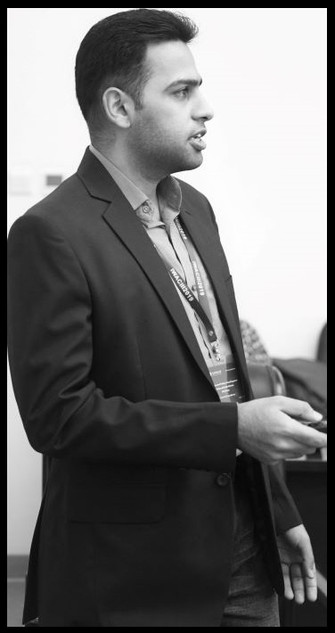

# About: Abdul Rehman, 2 2

Welcome to my page.

 <table>
  <tr>
    <td>
    I am a master's student at the School of Automation, China University of Geosciences, Wuhan, China. My core interests are cognitive computing, HRI/HCI, robotics, abstraction, and randomization. My skills range widely from Python to analog electronics, as I have mostly worked on IoT projects from top to bottom. Currently, I am interested in creating AI algorithms that can sustain themselves in the long run, i.e., adaptive control in the human world.
    </td>
    <td> </td>
  </tr>
</table>

As a final year grad student, I have been researching on speech emotion recognition and trying to build a real-time end-to-end analyzer. Here is a demo:

<iframe width="560" height="315" src="https://www.youtube.com/embed/q02u39fkYAw" frameborder="0" allow="accelerometer; autoplay; clipboard-write; encrypted-media; gyroscope; picture-in-picture" allowfullscreen></iframe>

* * *

# [Publications](#publications)

## Jorunal Articles

* [Z. -T. Liu, A. Rehman, M. Wu, W. Cao and M. Hao, "Speech Emotion Recognition Based on Formant Characteristics Feature Extraction and Phoneme Type Convergence", in Information Sciences (2020) Accepted.](/assets/about/Information-Sciences-Abdul-Rehman-SER-2020-preprint.pdf)

* [Z. -T. Liu, A. Rehman, M. Wu, W. Cao and M. Hao, "Speech Personality Recognition Based on Annotation Classification Using Log-likelihood Distance and Extraction of Essential Audio Features," in IEEE Transactions on Multimedia, doi: 10.1109/TMM.2020.3025108.](https://ieeexplore.ieee.org/document/9200766/)

## Conferences (peer-reviewed)

* [A. Rehman, Z. -T. Liu, D. -Y. Li and B. -H. Wu, "Cross-Corpus Speech Emotion Recognition Based on Hybrid Neural Networks", 2020 39th Chinese Control Conference (CCC), Shenyang, China, 2020, pp. 7464-7468, doi: 10.23919/CCC50068.2020.9189368.](https://ieeexplore.ieee.org/document/9189368)

* [A. Rehman, Z. -T. Liu, M. Wu, W. Cao and M. Hao, "Speech Emotion Recognition Based on PSO-SVR Using Personality Clusters", The 6th International Workshop on Advanced Computational Intelligence and Intelligent Informatics (IWACIII2019), Chengdu, China, 2019.](/assets/about/IWACIII-2019Speech_Emotion_Recognition_Based_on_PSO_SVR_Using_Personality_Clusters_after_review.pdf)

* * *

# [Education](#education)

- ### Masters
    - Control Science and Engineering, _Sep 2018 - July 2021_
    - [School of Automation, CUG, Wuhan, China](http://en.cug.edu.cn/)
    - [Major courses](/assets/about/MS_Unofficial_Transcript.htm)
    - Thesis: Speaker Independent Speech Emotion Recognition with Active Learning, [see more](/assets/about/SER_report_OCT2020_PPT.pdf)
    - Supervisor: [Z. -T. Liu](http://grzy.cug.edu.cn/liuzhendao/en/index.htm)
    - Lab: [Affective Computing](https://www.researchgate.net/lab/Zhen-Tao-Liu-Lab)

- ### Language
    - Chinese language and culture,
_Sep 2017 - July 2018_
    - Intensive 1 year course, [Silk Road Institute, CUG, Wuhan, China](https://iec.cug.edu.cn/English/Home.htm)

- ### MBA
    - Masters of Business Administration, _Feb 2015 - March 2017_
    -  Part-time, [Bahria University, Islamabad, Pakistan](https://en.wikipedia.org/wiki/Bahria_University)

- ### Bachelor
    - BS Electrical Engineering, _Oct 2010 - Jan 2015_
    - More like a nuclear boot camp, [PIEAS, Islamabad, Pakistan](https://en.wikipedia.org/wiki/Pakistan_Institute_of_Engineering_and_Applied_Sciences)

* * *

# [Work](#work)

* My 2+ years work experience and 10 major projects  (mostly IoT & Tanks) are listed in [my CV](/assets/about/CV_abdul_rehman.pdf).
* I am currently proficient in Python, Cpp, JS, C#, and Java... in that order.
* See my freelance portfolio and reviews at [PPH](https://pph.me/tabahi), and my open source codes at [GitHub](https://github.com/tabahi).

### Certs:
* English, [TOEFL, 2020](/assets/about/TOEFEL_Nov2020_Redacted.pdf)
* Mandarin, [HSK-IV, 2018](/assets/about/HSK_Report_2018.jpg)

### Awards:
* [Postgraduate Research, 2nd @ School, 2020](/assets/about/Academic_2nd_Award.jpg)
* [Internet+, Bronze @ China National, 2019](/assets/about/Internet_plus_award_2019.pdf)
* [Editor, PIEAS Student Magazine, 2013-2014](http://old.pieas.edu.pk/magazine/dareecha/)

### Memberships:

* IEEE, IEEE-SMC, Chinese Association for Artificial Intelligence, Pakistan Engineering Commission, WWF-Pakistan

### Non-academic interests:

* Archeology, cosmology, classical music, Time, rhythms and patterns in general.
* Literary: Realism, Dostoevsky, Non-fiction.

# [Contact](#contact)

* Email: abdulrehman [*a*] ieee . org, alabdulrehman [*a*] hotmail . fr
* Currently in [Wuhan](https://en.wikipedia.org/wiki/Wuhan) (UTC+8), Domicile in [Quetta](https://en.wikipedia.org/wiki/Quetta)

## Links

* [LinkedIn](https://www.linkedin.com/in/alabdulrehman/)

* [ResearchGate](https://www.researchgate.net/profile/Abdul_Rehman196)

* [ORICID](https://orcid.org/0000-0003-2345-2256)

* [CV in PDF](/assets/about/CV_abdul_rehman.pdf)

* [PeoplePerHour](https://pph.me/tabahi)

* [GitHub/codes](https://github.com/tabahi)

* [Instagram](https://www.instagram.com/where.22/)

